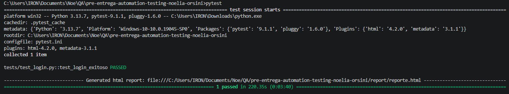
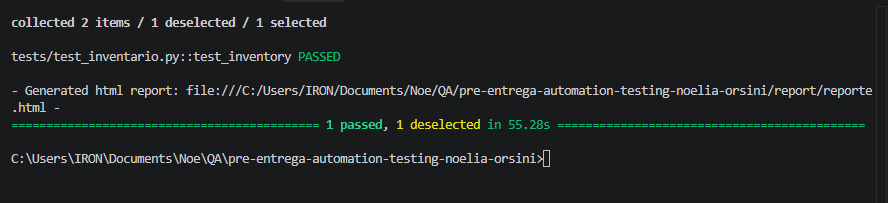
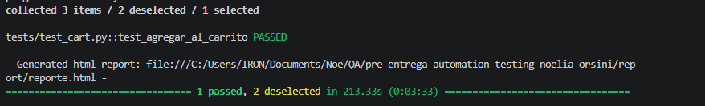

# SauceDemo — Automation Testing Suite

Este repositorio contiene la suite de pruebas automatizadas para la plataforma web SauceDemo ([saucedemo.com](https://www.saucedemo.com)).

El objetivo principal es validar la estabilidad y funcionalidad crítica de los flujos clave de la aplicación demo aplicando Selenium WebDriver, Pytest y buenas prácticas de arquitectura de software.

---

## 📌 Flujos Automatizados

1. **Autenticación (Login):** Validación de credenciales válidas, verificación de elementos clave de la interfaz (logo, título) y confirmación de la redirección al catálogo (`/inventory.html`).
2. **Navegación y Catálogo (Inventory):** Verificación de la carga de productos, validación de nombres/precios dinámicos e inspección de componentes de navegación.
3. **Gestión del Carrito (Cart):** Adición de productos al carrito, verificación del contador dinámico (*badge*) en la interfaz y confirmación de ítems dentro de la vista detallada del carrito.

---

## 🛠️ Tecnologías Utilizadas

* **Lenguaje:** Python 3.13+
* **Framework de Testing:** Pytest
* **Automatización Web:** Selenium WebDriver
* **Arquitectura de Pruebas:** Pytest Fixtures (`conftest.py`)
* **Reporte de Pruebas:** pytest-html
* **Control de Versiones:** Git & GitHub

---

## 📁 Estructura del Repositorio

```text
automation-saucedemo-noelia-orsini/
│
├── assets/                  # Capturas de evidencia y reportes visuales de ejecución
├── datos/                   # Archivos de datos de prueba (CSV/JSON)
├── report/                  # Reporte HTML autónomo generado tras las ejecuciones (reporte.html)
├── tests/                   # Suite de pruebas automatizadas y fixtures
│   ├── conftest.py          # Fixture global (inicialización del driver, esperas y teardown)
│   ├── test_login.py        # Pruebas del módulo de autenticación
│   ├── test_inventory.py    # Pruebas del catálogo de productos e inventario
│   └── test_cart.py         # Pruebas del módulo de carrito de compras
├── utils/                   # Funciones auxiliares y configuraciones globales
├── pytest.ini               # Configuración centralizada de Pytest, markers y reportes
├── README.md                # Documentación técnica del proyecto
└── requirements.txt         # Lista de dependencias del proyecto
```

---

## ⚙️ Instalación y Configuración

1. **Clonar el repositorio:**

   ```bash
   git clone [https://github.com/NoeliaOrsini/automation-saucedemo-noelia-orsini.git](https://github.com/NoeliaOrsini/automation-saucedemo-noelia-orsini.git)
   cd automation-saucedemo-noelia-orsini
   ```

2. **Crear y activar un entorno virtual:**
   * **Windows:**
     ```bash
     python -m venv venv
     venv\Scripts\activate
     ```
   * **macOS/Linux:**
     ```bash
     python -m venv venv
     source venv/bin/activate
     ```

3. **Instalar dependencias:**
   ```bash
   pip install -r requirements.txt
   ```

---

## 🔧 Decisiones Técnicas y Arquitectura del Framework

Para garantizar la máxima estabilidad, portabilidad y un uso eficiente de los recursos del sistema (optimizando la ejecución en entornos restringidos de memoria RAM), el framework incorpora las siguientes decisiones de diseño:

1. **Gestión Centralizada con Fixtures (`conftest.py`):**
   Uso de `@pytest.fixture` para inicializar el navegador y garantizar su cierre (`driver.quit()`) mediante `yield`, reduciendo código duplicado y asegurando la liberación de recursos.

2. **Aislamiento de Sesión y Perfiles Temporales (`tempfile`):**
   Cada prueba genera una carpeta temporal única con `tempfile.mkdtemp()` asignada a `--user-data-dir`. Esto elimina colisiones de sesiones previas, previene errores de puertos bloqueados (`DevToolsActivePort`) y garantiza ejecuciones independientes.

3. **Banderas de Estabilidad en `ChromeOptions`:**
   * `--no-sandbox`: Evita restricciones de permisos del sistema operativo.
   * `--disable-dev-shm-usage`: Fuerza el uso de la memoria RAM principal evitando el límite del almacenamiento compartido `/dev/shm`.
   * `--remote-allow-origins=*`: Autoriza las conexiones locales del ChromeDriver sin bloqueos de seguridad.
   * `--disable-gpu`: Desactiva la aceleración gráfica por hardware para optimizar el consumo de recursos.

4. **Estrategia de Esperas:**
   Se configuró una espera implícita global (`implicitly_wait(10)`) a nivel de fixture para dar margen al renderizado dinámico del DOM, previniendo fallos por desincronización de elementos.

5. **Reportes HTML Autónomos Centralizados (`pytest.ini`):**
   El archivo `pytest.ini` define la opción `addopts = -v -s --html=report/reporte.html --self-contained-html`, generando un informe visual consolidado en un solo archivo dentro de `report/reporte.html`.

6. **Escalabilidad Futura:**
La suite actual está estructurada para validar los flujos punta a punta de forma independiente. Como paso de optimización futura, se proyecta refactorizar los inicios de sesión redundantes en los módulos de `Inventory` y `Cart` utilizando fixtures de Pytest con alcance de sesión (`scope="session"`) o implementando el patrón de diseño Page Object Model (POM), para reducir la duplicación de código y acelerar los tiempos de ejecución.

---

## 🧪 Ejecución de Pruebas

Debido a la preconfiguración en `pytest.ini`, podés disparar la ejecución completa con un solo comando:

```bash
pytest
```

### Ejecución por Marcadores (*Markers*):
Para filtrar la ejecución por módulos específicos:

```bash
# Módulo de Login
pytest -m login

# Módulo de Inventario
pytest -m inventory

# Módulo de Carrito
pytest -m cart
```

---

## 📸 Evidencias de Ejecución

Los resultados gráficos e informes de prueba se encuentran respaldados en la carpeta `assets/`:

* **Prueba Módulo Login (`test_login.py`):**  
  

* **Prueba Módulo Inventario (`test_inventory.py`):**  
  

* **Prueba Módulo Carrito (`test_cart.py`):**  
  

*(El informe interactivo detallado en formato HTML se genera automáticamente en `report/reporte.html` tras cada ejecución).*

---

## 👩‍💻 Autora

**Noelia Orsini**  
*Desarrolladora Back-End | Abogada | Consultora Psicológica*

Soy Abogada, Counselor y Programadora. Trabajo en la intersección del derecho con la tecnología aportando una mirada humana, perfeccionándome constantemente en inteligencia artificial, desarrollo de software y procesos de automatización.

* **LinkedIn:** [noelia-orsini](https://www.linkedin.com/in/noelia-orsini/)
* **Portafolio:** [noelia-orsini-portafolio](https://noelia-orsini-portafolio.lovable.app/)

---
*Proyecto realizado para el curso de Talento Tech.*